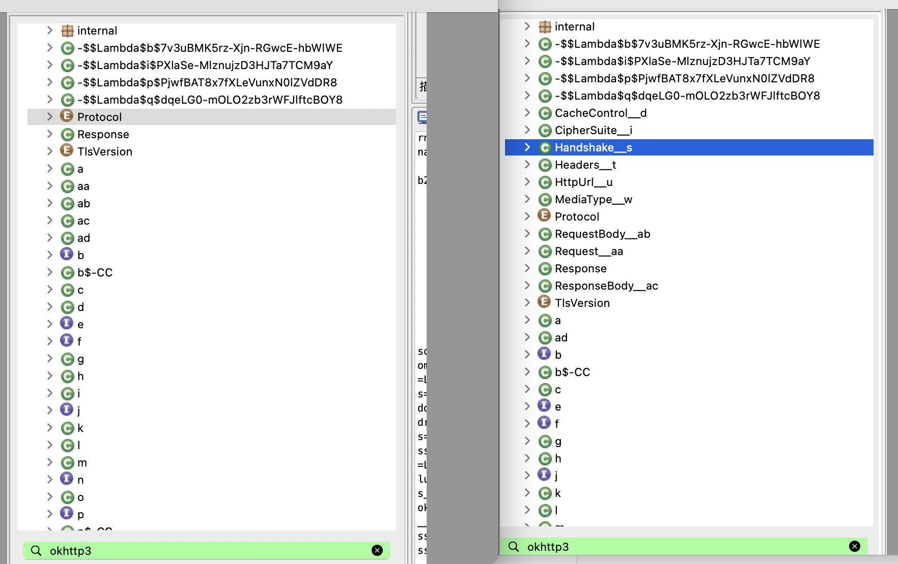
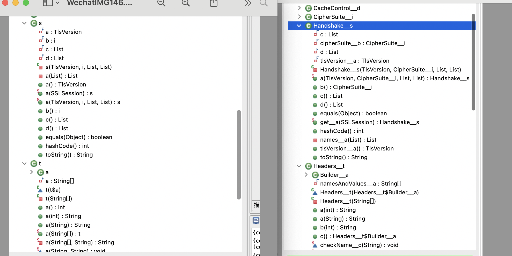

# Jeb_sscript  

## SyncRename.py 
###  基于源码的jeb反混淆方案
使用场景：如果遇到一个混淆了方法名和字段名称的类，能拿到其类的源码信息，那么即可实现对混淆类精准的还原。此处类可以进一步扩散成包或者sdk。常见于一些混淆apk使用了开源的sdk，可以根据对应sdk官方提供代码对混淆apk进行还原。

## 原理
待完成

## 使用方式
以同步重命名某app内混淆了okhttp3的例子：  
编译好一份OKhttp3的demo apk  
将demo apk和目标应用同时用jeb打开
运行脚本，输入要同步的包名 okhttp3  
等待重命名完成

## 实现效果  
还原包下的类名称：  
  
还原类下的Field和Method：  
  
## todo：目前完成了同类名下Field和Method的同步还原重命名。后续工作加入对内部类，实现接口，父类的重命名。还原效果会更好
